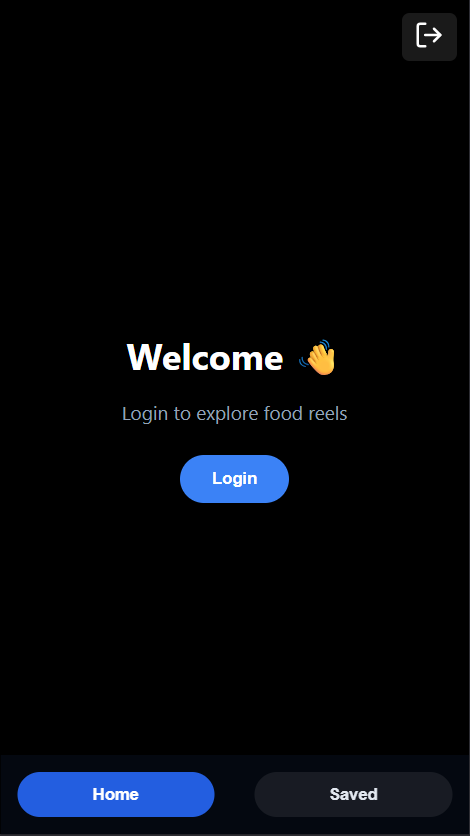
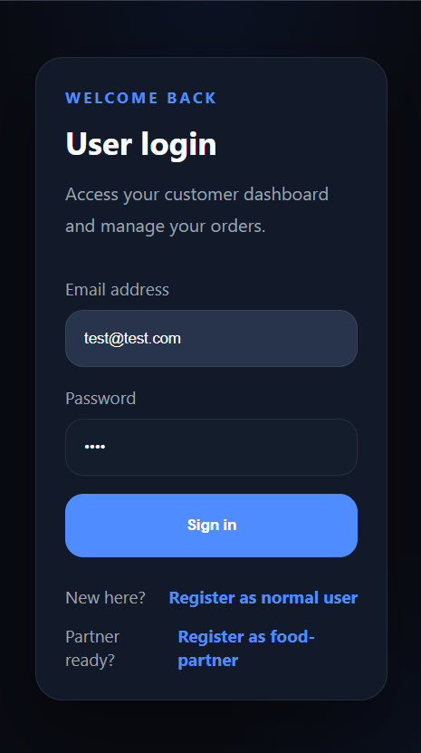
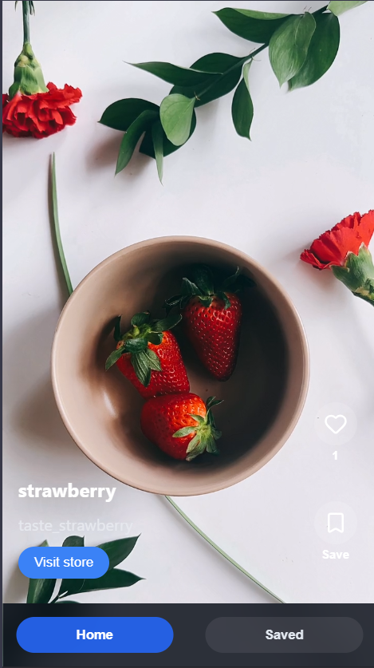
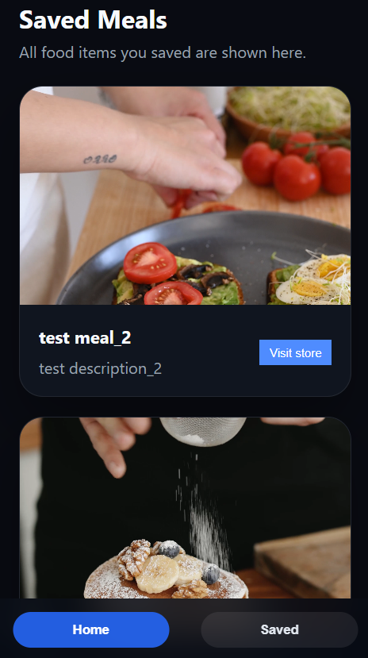
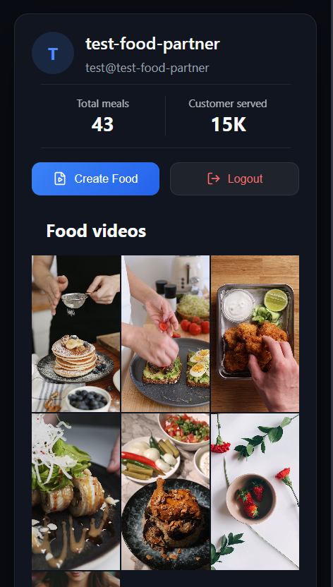
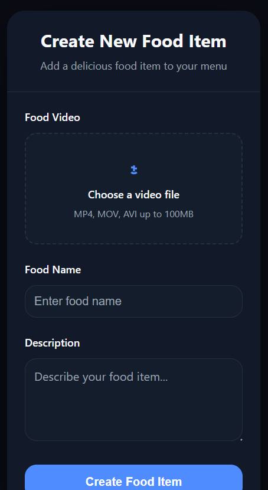

# 🍔 Food Reels Platform (MERN)
A full-stack MERN application inspired by Instagram Reels, featuring a video-first experience where users explore food content and creators upload short-form reels.

Designed with a mobile-first UI and deployed end-to-end with authentication, media uploads, and role-based access.

---
## 🌐 Live Demo
👉 Best viewed in mobile screen (mobile-first design)

- 🔗 Frontend: https://food-reels-app-1-frontend.onrender.com  
- 🔗 Backend API: https://food-reels-app-1-backend.onrender.com

---
## 📸 App Preview

### 🏠 Welcome
<p align="center">
  
</p>

### 🔐 User Login
<p align="center">
  
</p>

### 🎥 Reels Feed
<p align="center">
  
</p>

### 📌 Saved Meals
<p align="center">
  
</p>

### 👨‍🍳 Food Partner Profile
<p align="center">
  
</p>

### ➕ Create Food Item
<p align="center">
  
</p>

---
## 🚀 Features

### 👤 User

* 🔐 Register & Login (JWT Authentication with cookies)
* 🎥 Browse food reels (video-based UI)
* ❤️ Like food items
* 📌 Save food items
* 🧾 View saved meals
* 🏪 Visit food partner profiles

### 🧑‍🍳 Food Partner

* 🔐 Register & Login
* 👤 Profile with uploaded food items
* 🎥 Upload food reels (video + description)
* ➕ Create new food items
* 🚪 Logout functionality

---

## 🧠 Tech Stack

### Frontend

* React (Vite)
* Custom CSS (mobile-first UI)
* Axios
* React Router

### Backend

* Node.js
* Express.js
* MongoDB Atlas + Mongoose
* JWT Authentication
* Cookie-based auth (httpOnly)

---

## 🔐 Authentication & Security

* JWT stored in cookies
* Role-based access (User vs Food Partner)
* Protected routes for content creation
* Secure API calls using `withCredentials`

---

## 🚀 Deployment

- Frontend deployed on Render (Static Site)
- Backend deployed on Render (Web Service)
- MongoDB Atlas used as cloud database

---

## 📂 Project Structure

```
├── Backend/
│   ├── src/
│   │   ├── controllers/    # Request handlers & logic
│   │   ├── models/         # Database schemas
│   │   ├── routes/         # API endpoint definitions
│   │   ├── middlewares/    # Custom middleware 
│   │   ├── services/       # 3rd party integrations
│   │   ├── db/             # Database connection setup
│   │   └── app.js          # App configuration
│   └── server.js           # Entry point / Server start
│
└── Frontend/
    ├── src/
    │   ├── assets/         # Images, and static files
    │   ├── components/     # Reusable UI components
    │   ├── pages/          # Full-page views
    │   ├── routes/         # Client-side routing logic
    │   ├── styles/         # CSS or Sass files
    │   ├── App.jsx         # Root component
    │   └── main.jsx        # App entry point

```

---

## ⚙️ Installation

### 1. Clone repo

```
git clone https://github.com/codesketch11/food-reels-app.git
```

### 2. Backend setup

```
cd Backend
npm install
```

Create `.env`:

```
PORT=3000
MONGO_URI=your_mongodb_uri
JWT_SECRET=your_secret
```

Run:

```
npm run dev
```

---

### 3. Frontend setup

```
cd Frontend
npm install
npm run dev
```
---

## 🎯 Key Highlights

* Fully deployed full-stack application (frontend + backend)
* Role-based authentication system (User vs Food Partner)
* Video upload & media handling using multipart/form-data
* Mobile-first UI with reel-style interaction
* RESTful API design with protected routes

---

## 🙌 Author

Built by **Tushar Kamble**

- GitHub: https://github.com/codesketch11
- LinkedIn: https://www.linkedin.com/in/tushar-kamble-78ba71283

Focused on building real-world scalable full-stack applications.